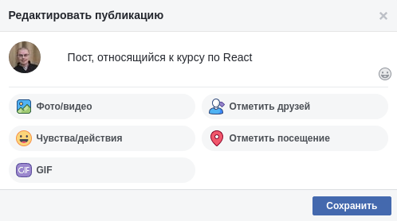

[CRUD](https://wee-owl.github.io/ra-router-crud/)
===

Необходимо реализовать CRUD при работе с HTTP с использованием Router.

Необходимо реализовать только ID, content и created, в качестве остальных значений - заглушки.

## Общая механика

При нахождении на странице `/` отображается список существующих постов, GET на адрес http://localhost:7070/posts. Полученные данные отображаются в виде карточек:

Кнопка «Создать пост» ведёт на страницу добавления (см. ниже) `/posts/new`. Помните про регулярные выражения.

При клике на саму карточку происходит переход на страницу просмотра поста (см. ниже) `/posts/{postId}`.

### Страница создания

На странице создания `/posts/new` отображается карточка создания:

При нажатии на кнопку «Опубликовать» пост сохраняется, после чего осуществляется редирект на главную страницу. POST на адрес http://localhost:7070/posts body: `{"id": 0, "content": "То, что введено в поле ввода"}`.

При нажатии на крестик в верхнем правом углу происходит редирект на главную без сохранения. Advanced: можете сохранить в localStorage и потом вытаскивать оттуда.

### Страница просмотра

На странице просмотра `/posts/{id}` отображается карточка просмотра:

При клике на кнопку «Удалить» происходит удаление поста, после чего осуществляется редирект на главную страницу. DELETE на адрес http://localhost:7070/posts/{id}.

При клике на кнопку «Редактировать» карточка просмотра заменяется карточкой редактирования:

На карточке редактирования:
* кнопка «Сохранить» приводит к сохранению поста и  отображению карточки просмотра с обновлёнными данными. POST на адрес http://localhost:7070/posts body: `{"id": не 0, "content": "То, что введено в поле ввода"}`;
* кнопка крестик приводит к возврату к карточке просмотра.
